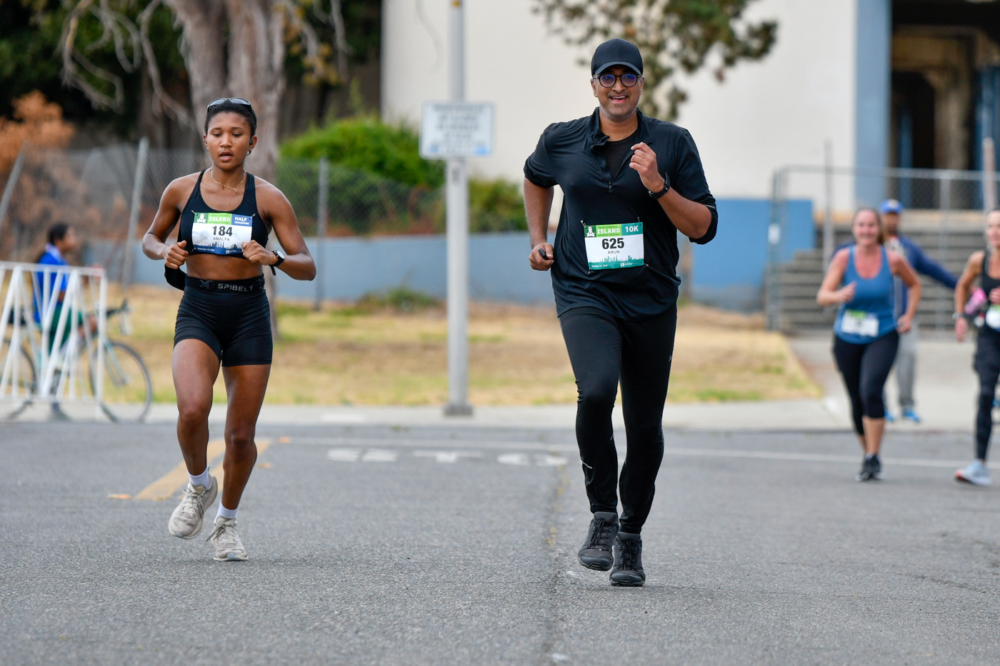

#### NY Marathon
I am currently training for the [TCS NYC Marathon](https://www.nyrr.org/tcsnycmarathon). I have been raising money for [NYRR Team for Kids](https://www.runwithtfk.org/Profile/PublicPage/101870/59039), and using a 16-week training plan from Runner's World.

#### Half Marathons
I have ran a few (3) half marathons, most recently the [Island Half Marathon](https://my.raceresult.com/263227/) in Alameda, CA where I finished 12th overall and 1st woman with a time of 1:31:17. My first ever race win! They took one awful photo of me.

 

.

